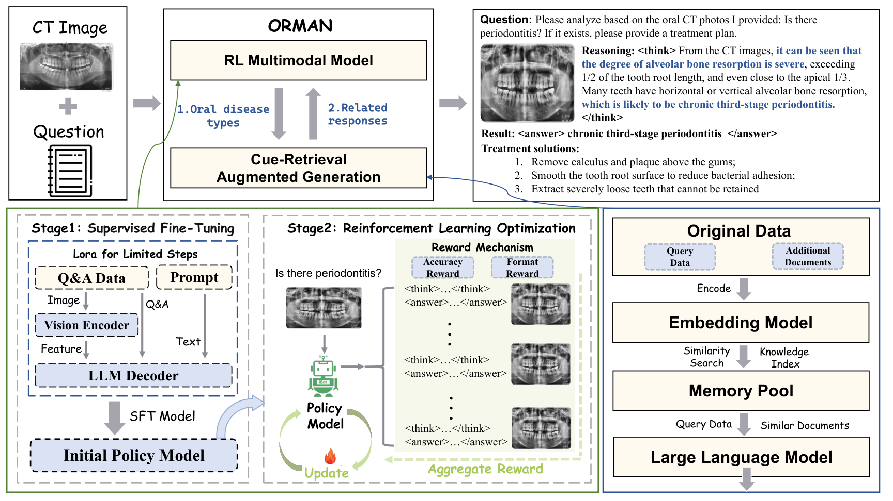

# PerioDx-Tx Net

Code, metadata schema, split definitions, sample assets, and reproducibility wrappers for a multimodal framework for periodontal diagnosis and guideline-grounded care-pathway drafting.

## Abstract

We developed and retrospectively validated a multimodal framework for periodontal diagnosis and for diagnosis-conditioned care-pathway drafting from routine panoramic radiographs and structured electronic records. The analytic cohort comprised 2,880 patients from two tertiary stomatology centers. The diagnostic module, **PerioM-Dx**, integrated image and text features through cross-attention and classified seven operational periodontal categories. The drafting module, **PerioQ-Tx**, retrieved and consolidated recommendations from a curated quality-scheme library using the diagnosis label as the query. On the held-out test set (`n = 288`), PerioM-Dx achieved strong multiclass discrimination and an overall accuracy of `0.804`. In a 100-case reader comparison, agreement between PerioM-Dx and expert consensus reached a weighted kappa of `0.748`, exceeding that of junior dentists. Within the curated library setting, PerioQ-Tx showed perfect top-rank retrieval and high scores for faithfulness, relevance, accuracy, and context utilization. The reported `99.2%` correctness for drafted plans is a **conditional module-level metric** assuming the diagnosis supplied to PerioQ-Tx is correct; it is not an unconditional end-to-end clinical effectiveness claim.

## Workflow Figure



[Workflow PDF](docs/figures/orman_workflow.pdf)

## Overview

PerioDx-Tx Net is organized around two tightly coupled modules:

1. **PerioM-Dx**: a multimodal diagnosis model built on `Qwen2-VL-2B-Instruct`, first adapted by supervised fine-tuning and then optimized with GRPO using rule-based accuracy and format rewards.
2. **PerioQ-Tx**: a diagnosis-conditioned, cue-memory-inspired retrieve-filter-generate-feedback pipeline that routes each diagnosis label to a curated periodontal quality-scheme library for clinician-reviewable draft plans.

The repository has been restructured so the manuscript-facing assets live in stable locations:

- `docs/` for cohort, label, EHR, evaluation, experimental setup, and results documentation
- `metadata/` for split summaries and label distributions
- `examples/` for de-identified EHR, output, and treatment-library examples
- `src/` for unified project entry points and wrappers
- `configs/` for manuscript-aligned wrapper configurations
- `data/samples/` for valid public sample records

The historical reference implementations remain under `multimodal/` and `H-frame-work/`. The canonical public entry points are the wrappers in `src/` and `scripts/`.

## Experimental Setup

### Study Cohort

- centers: West China Hospital of Stomatology, Sichuan University; Stomatology Hospital of Zhejiang University
- initial cohort: `3,500`
- excluded incomplete cases: `620`
- final analytic cohort: `2,880`
- split: train `2,016`, validation `576`, independent test `288`
- split policy: patient-level, no overlap across splits
- train/validation source: West China Hospital of Stomatology
- independent test source: two-center strategy

### Inputs And Outputs

- model inputs: panoramic radiograph + structured EHR
- auxiliary adjudication materials: intraoral photographs + probing results
- diagnosis task: unified seven-class classification
- generation schema:

```text
<think> ... internal audit rationale ... </think>
<answer> ... final diagnosis and structured management summary ... </answer>
```

Only the `<answer>` block is used for quantitative evaluation.

### PerioM-Dx Training

- base model: `Qwen2-VL-2B-Instruct`
- fusion strategy: cross-attention between serialized EHR tokens and radiograph patch tokens
- Stage 1 SFT: LoRA with `rank = 8`, `learning rate = 2e-5`, `batch size = 4`
- Stage 2 RL: Group Relative Policy Optimization (GRPO)
- RL rewards: format reward + exact-match diagnosis accuracy reward

### PerioQ-Tx Drafting

- knowledge source: curated periodontal quality-scheme library grounded in guideline and consensus material
- retrieval backend: Elasticsearch
- retrieval query: diagnosis label
- initial retrieval beam width: `k = 40`
- overlap filter: BLEU-based similarity threshold `> 0.4`
- cue-memory policy: initialized from training corpus and frozen during reported evaluation

### Evaluation Protocol

- diagnosis: one-vs-rest ROC analysis, macro-averaged ROC-AUC, overall accuracy, class-wise precision, sensitivity, specificity, F1, confusion matrix
- reader comparison: 100-case subset, weighted Cohen's kappa and mean time per case
- drafting retrieval: Hit Rate@1, MRR, NDCG@3, Context Precision
- drafting quality: Faithfulness, Answer Relevance, Accuracy, Context Utilization
- conditional module-level evaluation: Correctness, Usefulness, Safety

Detailed setup notes are in [docs/experimental_setup.md](docs/experimental_setup.md).

## Experimental Results

### Diagnostic Performance

- overall test accuracy: `0.804`
- 100-case reader-study weighted kappa:
  - PerioM-Dx: `0.748`
  - junior dentists: `0.631`
- attention allocation:
  - panoramic radiograph tokens: `59.8%`
  - specialist periodontal examination fields: `26.3%`

Class-wise diagnosis performance from the manuscript:

| Class | F1-score | Sensitivity / Recall | Precision |
| --- | ---: | ---: | ---: |
| Gingivitis | 0.81 | 0.80 | 0.88 |
| Periodontitis Stage I | 0.83 | 0.90 | 0.76 |
| Periodontitis Stage II | 0.69 | 0.79 | 0.53 |
| Periodontitis Stage III | 0.87 | 0.85 | 0.90 |
| Periodontitis Stage IV | 0.66 | 0.70 | 0.66 |
| Epulis | 0.82 | 0.80 | 0.85 |
| Combined Periodontal-Endodontic Lesion | 0.71 | 0.61 | 0.83 |
| Macro-average | 0.77 | 0.78 | 0.77 |

### Retrieval And Drafting Performance

| Metric | PerioQ-Tx | TF-IDF baseline |
| --- | ---: | ---: |
| Hit Rate@1 | 1.00 | 0.74 |
| MRR | 1.00 | 0.75 |
| NDCG@3 | 1.00 | 0.68 |
| Context Precision | 100% | 64.3% |

Plan-quality scores reported in the manuscript:

| Metric | Gingivitis | Stage I | Stage II | Stage III | Stage IV | Epulis | Combined periodontal-endodontic lesion |
| --- | ---: | ---: | ---: | ---: | ---: | ---: | ---: |
| Faithfulness | 100% | 100% | 100% | 100% | 100% | 100% | 100% |
| Answer Relevance | 100% | 98.5% | 99.2% | 99.5% | 99.8% | 100% | 99.0% |
| Accuracy | 100% | 97.8% | 98.6% | 99.0% | 99.2% | 100% | 98.5% |
| Context Utilization | 100% | 96.3% | 97.5% | 98.2% | 98.8% | 100% | 97.0% |

Conditional module-level evaluation:

| Metric | Score | Acceptance threshold |
| --- | ---: | ---: |
| Correctness | 99.2% | >= 90% |
| Usefulness | 98.5% | >= 85% |
| Safety | 100% | 100% |

Detailed result tables are in [docs/experimental_results.md](docs/experimental_results.md).

## Public Release Scope

This public workspace includes:

- documentation and reproducibility wrappers
- manuscript-aligned experimental setup and result summaries
- de-identified example schemas
- valid sample records in a normalized repository format
- archived legacy sample files under `data/legacy/`
- workflow assets under `docs/figures/`

This public workspace does **not** include raw radiographs or structured EHR from the full clinical cohort.

## Quick Start

Install the lightweight wrapper environment:

```bash
pip install -r requirements.txt
```

Normalize a public sample file into SFT-ready format:

```bash
python scripts/preprocess_data.py \
  --input data/samples/dataset_train.sample.json \
  --output results/diagnosis/train_sft_ready.json
```

Preview the manuscript-aligned SFT command:

```bash
python scripts/run_train.py periom-dx-sft --config configs/periom_dx_sft.yaml --dry-run
```

Preview the GRPO command:

```bash
python scripts/run_train.py periom-dx-grpo --config configs/periom_dx_grpo.yaml --dry-run
```

Build and query a sample treatment index:

```bash
python scripts/run_train.py perioq-tx-index --config configs/perioq_tx.yaml
python -m src.perioq_tx.retrieve --config configs/perioq_tx.yaml
```

Evaluate answer-only diagnosis outputs:

```bash
python scripts/run_eval.py periom-dx \
  --predictions results/diagnosis/predictions.json \
  --references data/samples/dataset_test.sample.json
```

## Data Access

Code, prompt templates, de-identified example schemas, and reproducibility wrappers are available in this repository. Because the underlying clinical records contain patient-sensitive information, raw patient-level radiographs and EHR are not publicly posted. Subject to institutional and ethical approval, parts of the derived data supporting the findings may be made available from the corresponding authors upon reasonable request.
